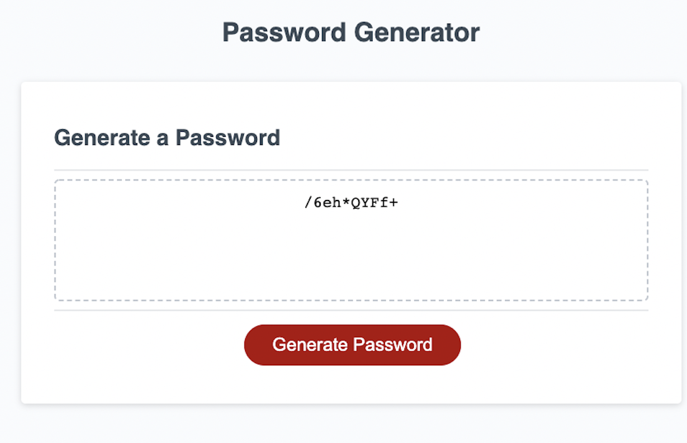

# password-generator
This repo holds the challenge for my third module where I created a password generator based off a small ammount of starter code. With this password generator
the user can select how long they want there password to be between 8 and 128 
characters. They can also select the criteria for their password. They can select
whether they want uppercase letters, lowercase letters, numbers, and symbols. The generator will then take all that input and generate a totally random password
based on the user input criteria.

## What I learned
In this challenge I worked on my skills with Javascript and integrating Javascript with CSS and HTML. I practiced the following skills:
- Using arrays
- Using functions
- Using for loops
- Using while loops
- Using conditional statements
- Using NaN
- Using an addEventListener to change the HTML text

## Website URL
[ckkorson.github.io/password-generator](https://ckkorson.github.io/password-generator/)

## Website Screenshot

